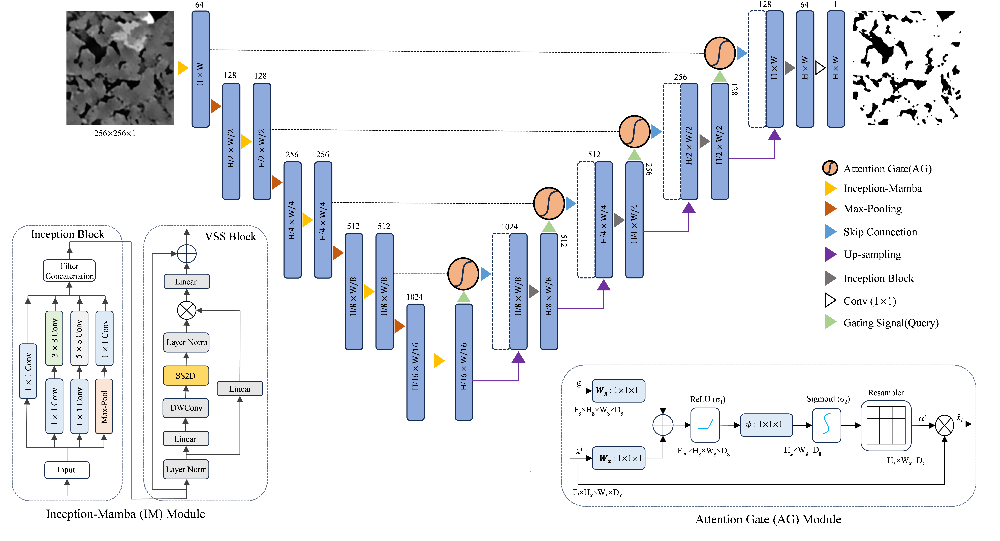

# IAM-UNet: A Hybrid State-Space and Multi-Scale Feature Fusion Network for Digital Rock Image Segmentation

<p align="center">
  
</p>

<p align="center">
  <a href="https://www.digitalrocksportal.org/projects/317/">
    
  </a>
  
  
  
</p>

---

> **IAM-UNet** is a hybrid encoder–decoder segmentation framework that integrates **Inception multi-scale convolutions**, **Mamba-based selective state-space modeling (SS2D)**, and **Attention-guided skip-connection fusion** within a unified U-Net topology. It is designed for accurate binary pore–solid segmentation of micro-CT digital rock images, and achieves state-of-the-art performance across pixel-level, morphological, and petrophysical evaluation criteria.

---

##  Highlights

-  **Best performance** across all 4 metrics (Dice, IoU, Precision, Recall) vs. 9 baseline models
-  Novel **Inception–Mamba (IM) block** combining local multi-scale and global long-range feature extraction
-  **Attention Gate** on every skip connection suppresses irrelevant grain-matrix responses
-  Validated with **morphological analysis** (S₂, C₂, L₂, CLD) and **petrophysical simulation** (FEM + LBM)
-  Permeability relative error of only **0.22557%** — the lowest among all compared models

---


##  Repository Structure

```
IAM-UNet/
├── net.py                  # Full model architecture
├── train.py                # Training script
├── test.py                 # Inference & evaluation script
├── calculate_matrix.py     # Evaluation metrics (Dice, IoU, Precision, Recall)
├── architecture.jpg        # Architecture diagram

```


## ⚙️ Installation

### Requirements

```bash
python >= 3.8
torch >= 1.12
torchvision
timm
Pillow
numpy
mamba_ssm        # Required for SS2D selective scan
```

### Install Dependencies

```bash
pip install torch torchvision timm Pillow numpy
pip install mamba_ssm   # CUDA required; see https://github.com/state-spaces/mamba
```

> **Note:** `mamba_ssm` requires a CUDA-capable GPU. If unavailable, a custom `selective_scan` fallback can be substituted (see `net.py` import block).

---

##  Usage

### 1. Prepare Dataset

Organize your data in the following structure:

```
datasets/
├── train/
│   ├── input/    ← grayscale micro-CT slices (.png / .jpg)
│   └── mask/     ← binary segmentation masks (same filenames)
└── test/
    ├── input/
    └── mask/
```

### 2. Training

```bash
python train.py
```

Key training hyperparameters (configurable in `train.py`):

| Parameter | Value |
|:---|:---:|
| Optimizer | Adam |
| Learning rate | 1e-4 |
| Beta₁ / Beta₂ | 0.5 / 0.999 |
| Loss function | MSE |
| Batch size | 8 |
| Epochs | 100 |
| Input size | 256 × 256 |
| Train/Val split | 80% / 20% |

Checkpoints are saved every 10 epochs and at the end of training to `savemodel/`. Training logs (Loss, Dice, IoU, Precision, Recall) are exported as CSV files.

### 3. Inference & Evaluation

```bash
python test.py
```

Loads `savemodel/net.pth`, runs inference on the test set, saves predicted masks to `savemodel/pred/`, and writes `test_metrics.txt` and per-image CSV.

### 4. Standalone Metric Calculation

```bash
python calculate_matrix.py
```

Computes average Dice, IoU, Precision, and Recall from saved predicted masks vs. ground-truth masks.

---

##  Evaluation Metrics

All metrics are computed with **pore pixels as the positive class** (masks are inverted before calculation, since pores are the minority region).

| Metric | Formula |
|:---|:---|
| **Dice** | 2·TP / (2·TP + FP + FN) |
| **IoU** | TP / (TP + FP + FN) |
| **Precision** | TP / (TP + FP) |
| **Recall** | TP / (TP + FN) |

In addition to pixel-level metrics, the paper reports:
- **Morphological validation:** S₂(r), C₂(r), L₂(r), CLD(r), PSD
- **Elastic properties (FEM):** Bulk modulus, Shear modulus, P-wave velocity, S-wave velocity
- **Permeability (LBM):** Absolute permeability with relative error

---

##  Experimental Setup

| Setting | Value |
|:---|:---|
| GPU | NVIDIA Tesla V100-PCIE (32 GB) |
| Framework | PyTorch |
| Input size | 256 × 256 pixels |
| Repeated runs | N = 5 (mean ± std reported) |
| Threshold | 0.5 (sigmoid output → binary mask) |

---

##  Training Outputs

After training, the following files are saved in `savemodel/`:

```
savemodel/
├── net.pth                      # Final model weights
├── net_10.pth ... net_100.pth   # Epoch checkpoints (every 10 epochs)
├── Train Loss.csv
├── Val Loss.csv
├── Train Dice.csv  / Val Dice.csv
├── Train IoU.csv   / Val IoU.csv
├── Train Precision.csv / Val Precision.csv
├── Train Recall.csv    / Val Recall.csv
├── test_metrics.txt             # Average test metrics
├── test_metrics_per_image.csv   # Per-image test metrics
└── pred/                        # Binary prediction images
```

---

##  Known Issues & Notes

> ⚠️ **Import name mismatch:** `train.py` and `test.py` import from `matrix`, but the metrics file is named `calculate_matrix.py`. Rename it or add an alias:
> ```bash
> # Option 1: rename the file
> mv calculate_matrix.py matrix.py
> # Option 2: create a soft link / copy
> cp calculate_matrix.py matrix.py
> ```

> ⚠️ **Mamba dependency:** `SS2D` requires `mamba_ssm` with a CUDA GPU. CPU-only environments will raise an `ImportError` at `forward_core()`.

---


---

##  Acknowledgments

This work was supported by the **Deep Earth Probe and Mineral Resources Exploration Major Project, National Science and Technology**, under Grant No. **2025ZD1010908**.

The sandstone dataset is publicly available on the [Digital Rocks Portal](https://www.digitalrocksportal.org/projects/317/)

---

##  Contact

**Md. Yamin Khan**  
Email: [khanyamin687@gmail.com](mailto:khanyamin687@gmail.com)  
School of Resources and Safety Engineering  
Central South University, Changsha, 410083 Hunan, China

For questions or collaborations, please open an issue or contact via the repository.

---

<p align="center">
  <sub>© 2025 IAM-UNet Authors. All rights reserved.</sub>
</p>

